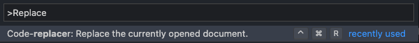

# code-replacer-vscode-plugin

Replace codes line by line with regex for target files

## Demo

## Environment

Tested on `Windows 10`, `macos`

## How to install

Search this plugin in vscode's [marketplace](https://marketplace.visualstudio.com/items?itemName=jopemachine.code-replacer).

Or download and import vsix file.

## How to use

1. Activate the plugin using below methods.

### 1 - keyboard shortcut

**(windows) <kbd>Ctrl</kbd> + <kbd>Alt</kbd> + <kbd>R</kbd>**

**(macos) <kbd>Ctrl</kbd> + <kbd>Command</kbd> + <kbd>R</kbd>**

### 2 - Using <kbd>Ctrl</kbd> + <kbd>Shift</kbd> + <kbd>P</kbd>

2. Select `csv` in your work directory. 

3. Select `template` in your usage logs or type the `template` value.

4. Select options

5. Run code-replacer according to selected options

## Related Repository

This extension is a plugin of below.

* [code-replacer](https://github.com/jopemachine/code-replacer)

